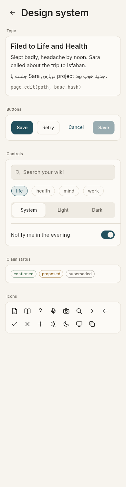
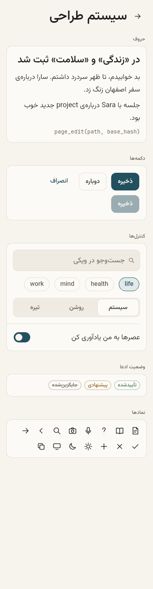
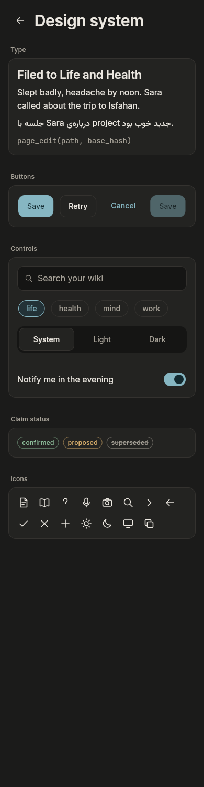
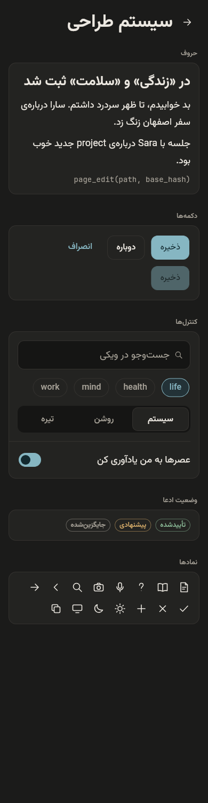

# Daftar style guide — "calm paper, precise ink"

Screenshots are the golden images and are regenerated by the tests, so they never drift from the code:

| | English | فارسی |
|---|---|---|
| Light |  |  |
| Dark |  |  |

Screens: `app/test/golden/goldens/settings_{light,dark}_{en,fa}_{phone,desktop}.png`.

## Tokens (`app/lib/design/tokens.dart`)

**Spacing:** 4-pt grid (`Space.x1`…`x16`); phone gutter 16; prose measure 680.
**Radii:** 10 small, 12 medium (controls), 14 large (surfaces), pill.
**Lines:** 1 px hairlines separate everything; no shadows. Focus ring: 2 px accent.
**Motion:** 150 / 200 / 250 ms, ease-out cubic. Zero when the OS asks to reduce motion.
**Targets:** ≥ 44 pt for every tappable element (`Pressable` enforces it).

### Colour

| Token | Light | Dark | Use |
|---|---|---|---|
| paper | `#F7F4EE` | `#1B1B1A` | page |
| raised | `#FCFAF6` | `#232321` | surfaces, sheets |
| sunken | `#EFEBE3` | `#151514` | inputs, tracks, hover |
| ink | `#1D1C1A` | `#ECE8E1` | text |
| inkMuted | `#625D55` | `#A7A298` | secondary text (AA) |
| inkFaint | `#A29C92` | `#6E6A63` | decoration only |
| hairline | `#E2DCD1` | `#34322F` | lines, borders |
| **accent** | `#22505E` | `#86B6C2` | the one accent: primary actions, links, selection |
| positive / pending / critical | muted green / amber / rust | | status only |

### Type

| Style | Latin (Inter) | Persian (Vazirmatn) |
|---|---|---|
| display | 30 / 600 / 1.25 | 34 / 600 / 1.5 |
| title | 22 / 600 | 25 / 600 |
| heading | 17 / 600 | 19 / 600 |
| body | 16 / 400 / 1.55 | 18 / 400 / 1.8 |
| small | 14 / 400 | 16 / 400 |
| label | 14 / 500 | 16 / 500 |
| caption | 12 / 500 | 13 / 500 |
| mono | JetBrains Mono 14 | |

## Rules

* No sparkle/robot/brain imagery, gradients, glass, emoji, chat-bubble tails, or Material chrome.
* The assistant has no name or avatar. Copy is short and concrete.
* Directional icons (back, chevrons) mirror in RTL; media icons never do.
* Paragraph direction is decided per paragraph by content, independent of UI language.
* Every text/surface pair is enforced ≥ 4.5:1 by `test/design/contrast_test.dart`.
